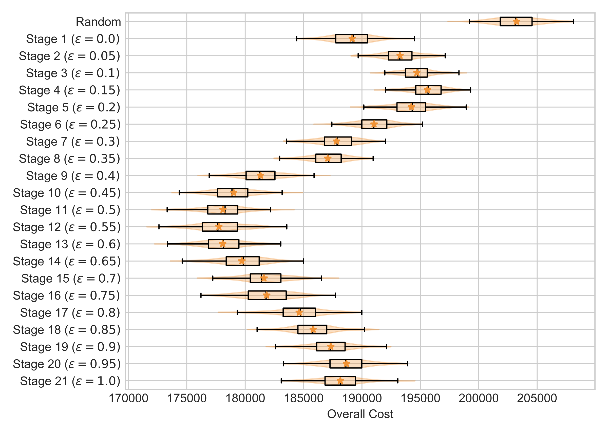
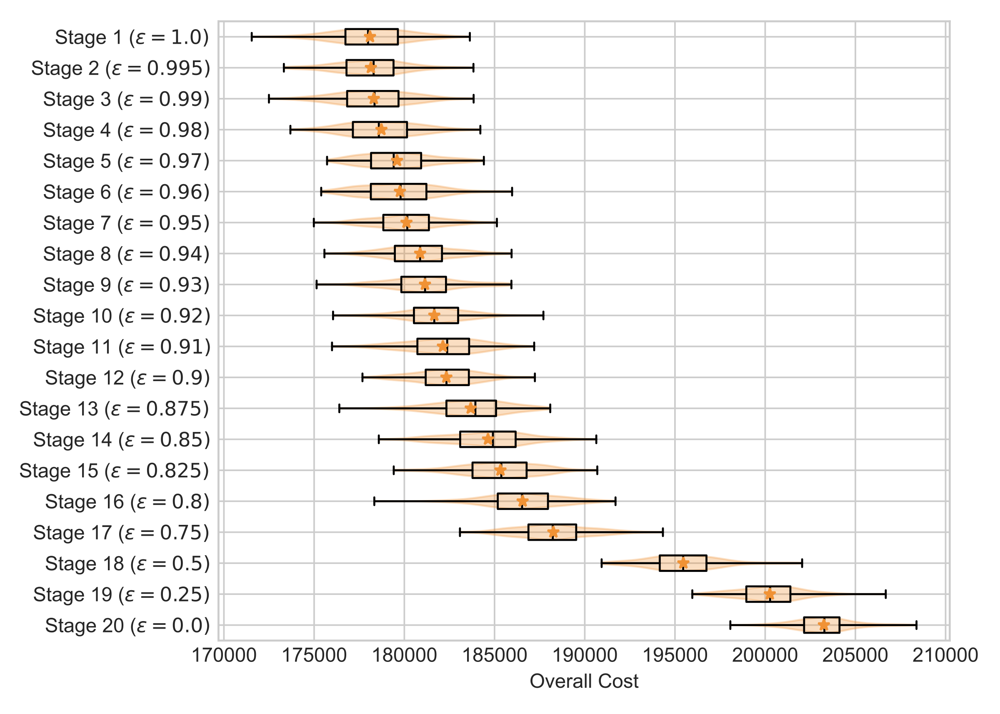

# Improving ICU Patient Bed Moves Policies with Reinforcement Learning Based Simulation-Optimisation


## Usage

Ensure that you have Python 3.12 on your computer. To install:

```
$ python3.12 -m venv env
$ source env/bin/activate
$ python -m pip install -r requirements.txt
```

To run the tests:

```
$ cd src
$ python -m pytest .
```

## Training

To train a policy, create a folder `<experiment_name>` inside `src/experiments/`, and place a parameter file inside: `params.yml`. For example `main_run`. Then to train on 5 parallel cores:

```
$ mkdir src/experiments/main_run/results/
$ mkdir src/experiments/main_run/results/tmp
$ python training.py src/experiments/main_run/ 5
```

To evaluate the incumbent policies at each stage:

```
$ python evaluation.py src/experiments/main_run/ 5
```

This generates `src/experiments/main_run/results/cost_per_stage.pdf`:



Use this to find the best early-stop incumbent policy: here the best performing policy of that after 12 stages of training. Then to evaluate that policy's robustness:

```
$ python robust_evaluation.py src/experiments/main_run/ 5 12
```

This generates `src/experiments/main_run/results/robust_evaluation.pdf`:




## Policies
Final policies are stored in `policy/`. There are two types,

+ the deployment policy: a mapping from states to best actions.
+ the training policy: a mapping from state-action pairs to Q-values

To read the __deployment policy__:

```
>>> import numpy as np
>>> keys = np.fromfile("policy/stage_31_overall_policykeys_epsilon_1.0.bin", dtype=np.int64)
>>> actions = np.fromfile("policy/stage_31_overall_policyactions_epsilon_1.0.bin", dtype=np.int16)
```

The keys and actions are _hashed_, that is integers representing the states and actions. To dehash them:

```
>>> import ward
>>> hstate = 509653809300000
>>> hbestaction = 505

>>> state, patient_type = ward.dehash_state(hstate)
>>> patient_type
0
>>> state
[1 1 1 1 1 0 1 1 1 1 1 1 1 1 0 0 0 0 0 0 0 0 0 0 0 0 0 0 0 0 0 0 0 0 0 0 0 0 0 0 0 0 0 0 0]

>>> a1, a2 = ward.dehash_action(hbestaction)
>>> a1
5
>>> a2
5
```

and to re-shape the state into the correct 3x15 matrix:

```
>>> state.reshape(3, 15)
[[1 1 1 1 1 0 1 1 1 1 1 1 1 1 0]
 [0 0 0 0 0 0 0 0 0 0 0 0 0 0 0]
 [0 0 0 0 0 0 0 0 0 0 0 0 0 0 0]]
```

Policies only contain the representative states. To generate _all_ states (note that if `state` is a fixed point of any of the permutations, then this will generate duplicates):

```
>>> for idx, permutation in enumerate(ward.equivalence_permutations):
>>>     s = state[permutation]
>>>     hashed_s = ward.get_hash_state_only(s, patient_type)
>>>     a = ward.inverse_action(hbestaction, idx)
```

To read the __training policy__:

```
>>> import numpy as np
>>> training_keys = np.fromfile("policy/stage_31_overall_keys_epsilon_1.0.bin", dtype=np.int64)
>>> training_vals = np.fromfile("policy/stage_31_overall_qvals_epsilon_1.0.bin", dtype=np.float32)
```

The array `training_vals` contains negative real numbers, the closer to 0 the better. The array `training_keys` contains hashes of the state-action pairs. To de-hash them:

```
>>> hstateaction = 476563044600104
>>> hstate, haction = ward.get_state_action_from_hashstate(hstateaction)

>>> hstate
476563044600000
>>> haction
104

>>> state, patient_type = ward.dehash_state(hstate)

>>> state
[[1 0 1 1 0 1 0 1 1 1 1 1 1 1 0]
 [0 1 0 0 0 0 0 0 0 0 0 0 0 0 0]
 [0 0 0 0 0 0 0 0 0 0 0 0 0 0 1]]
>>> patient_type
0

>>> a1, a2 = ward.dehash_action(haction)
>>> a1
1
>>> a2
4
```
